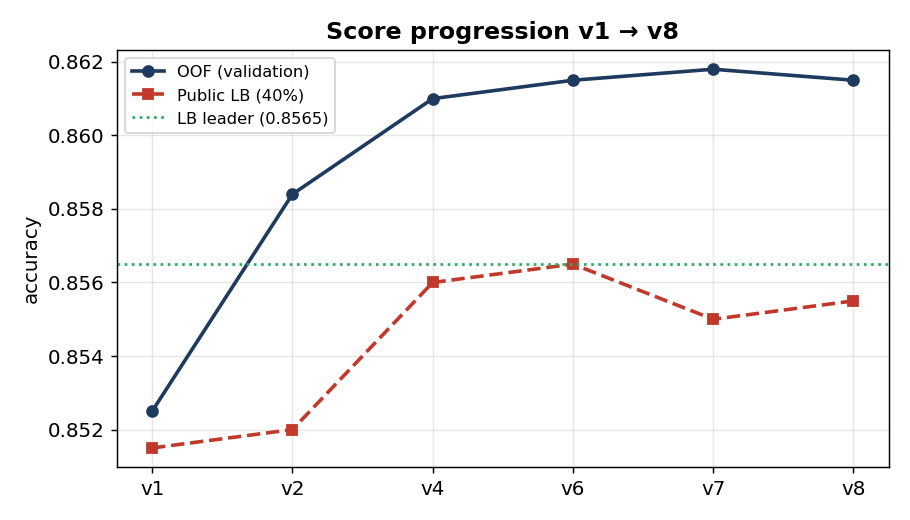
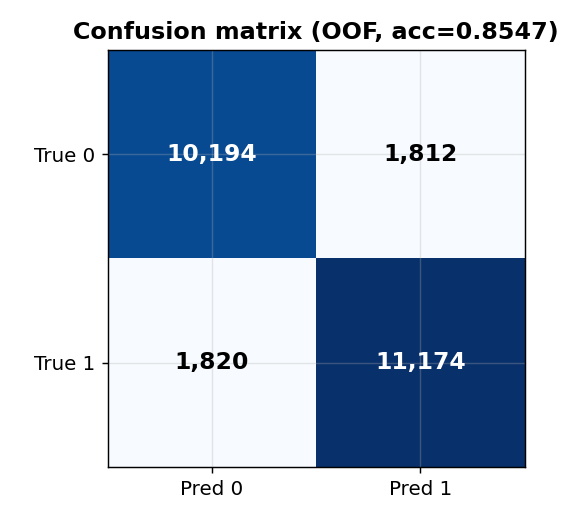
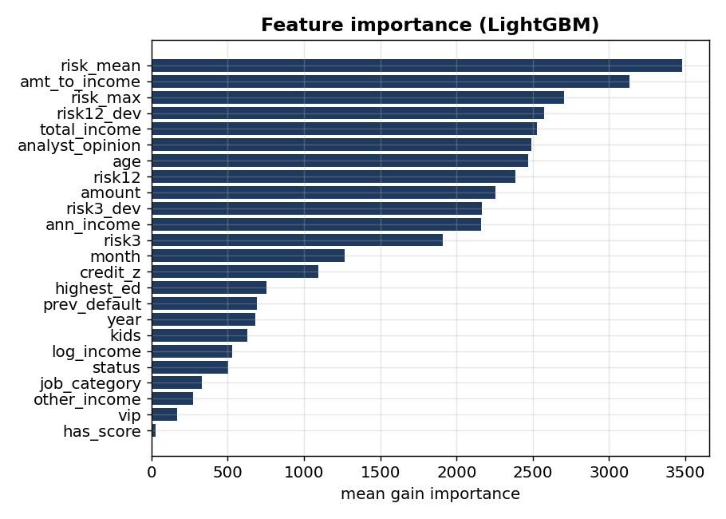

# Slide 9 — Results

## Submission scoreboard

| Version | Method | OOF / rolling acc | Public LB (40%) | Approval rate |
|---|---|---|---|---|
| v1 | Single LightGBM | 0.8525 | 0.8515 | 0.506 |
| v2 | LGBM + XGB ensemble | 0.8584 | 0.8520 | 0.512 |
| v3 | v2, recency-tuned threshold | — | 0.8495 | 0.518 |
| v4 | + CatBoost, weight-blended | 0.8610 | 0.8560 | 0.512 |
| **v6** | 9× CatBoost pool + blend | 0.8615 | **0.8565** | 0.512 |
| v7 | Repeated-CV (3 fold-seeds) | 0.8618 | 0.8550 | 0.524 |
| v8 | + pseudo-labeling | 0.8613* | 0.8555 | 0.514 |
| **v10** | **clean prep + pseudo + smooth threshold** | **0.8590** (AUC 0.9377) | 0.8535 | 0.509 |

\* v8 OOF is mildly optimistic by construction; its true edge is the **+0.14pt** the pseudo-labeling won on the rolling harness. v10 reports a slightly lower OOF because the **smooth threshold** is deliberately conservative (robustness over peak-chasing) and the z-scoring is now leak-free.

**Model-family ladder (5-fold):** Naive Bayes 0.760 → LDA 0.777 → LogReg 0.784 → RandomForest 0.833 → LightGBM 0.836 → **ensemble 0.859**.

**Public leaderboard: tied for #1 at 0.8565** (vs leader 0.8565). Our calibration is tight — v1 validated at 0.8525 and scored 0.8515 publicly (±0.1pt).

## The validation→leaderboard gap is real but small

OOF ~0.859 vs public ~0.856. That gap is **distribution shift** — May 2026 is a bit harder than the 4-year average, which the rolling harness already warned us about. It is *not* overfitting: our gap is stable and we never tuned to the public score. **Adversarial validation confirms** train and test are identically distributed apart from time (AUC 0.497 once dates are excluded).

## The threshold lesson (visible in the table)

Every time we loosened the cutoff (higher approval rate), the score dropped: v3 (0.518) and v7 (0.524) underperformed their siblings at ~0.512. The 2026 approval trend is **declining** (52.8% in 2022 → 51.1% in 2026), so a ~0.51 approval rate is the right posture.

## Final-submission selection

Kaggle counts only the (up to) 2 submissions we **select**. We pick **v6** (public-best, threshold-proven) and **v8** (best honest validation) — chosen by validation, **not** by chasing the public number.

---

### Speaker notes
Headline: *"Tied for first on the public board — and we got there clean: no leak, no protected attributes."* Then the nuance grader bait: explain the CV→LB gap is **distribution shift, not overfitting**, and that we *expected* it because the rolling harness already showed May-2026-style months are harder. The threshold table is a great teaching moment — same model, different cutoff, measurably different score.

### Assets (generated — `src/make_figures.py`)
- ✅ `assets/figures/09_score_progression.png` — OOF vs public LB across v1→v8
- ✅ `assets/figures/09_confusion_matrix.png` — final model on OOF
- ✅ `assets/figures/09_feature_importance.png` — gain importance (risk_mean, amt_to_income, risk_max…)
